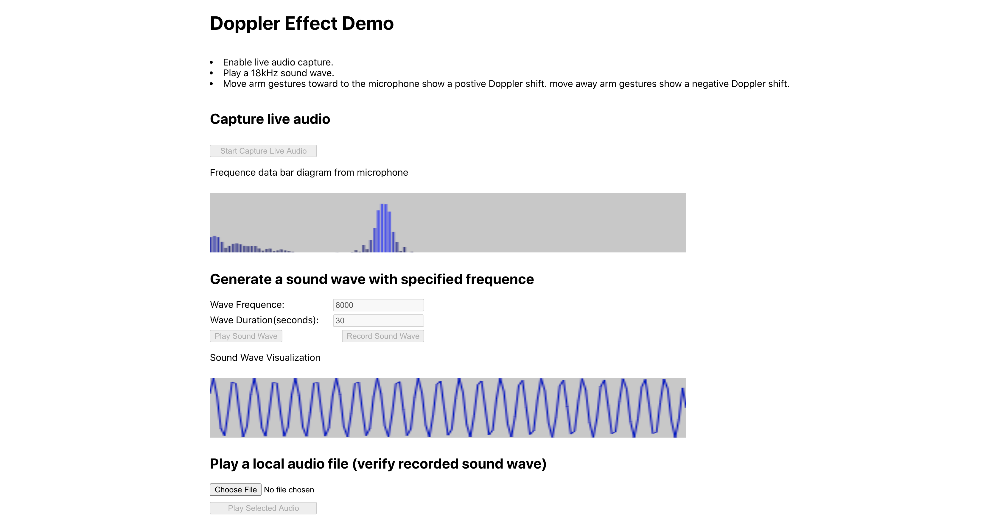

# Overview

A demo for [SoundWave: Using the Doppler Effect to Sense Gestures](https://www.microsoft.com/en-us/research/wp-content/uploads/2016/11/GuptaSoundWaveCHI2012.pdf).  
The demo is implemented with [Web Audio API](https://developer.mozilla.org/en-US/docs/Web/API/Web_Audio_API), tested with Chrome and Safari.  

## Features

### Audio Capture and Visualization

Access connected microphones with [MediaDevices API](https://developer.mozilla.org/en-US/docs/Web/API/MediaDevices) to capture live audio. 
Connnect audio with [AnalyserNode](https://developer.mozilla.org/en-US/docs/Web/API/AnalyserNode) for frequence analysis. 
When play a high frequency(>18KHz) sound wave, move arm gestures toward to the microphone show a postive Doppler shift. move away arm gestures show a negative Doppler shift. 

### Sound Wave Generation and Visualization

Generate sound wave with [OscillatorNode](https://developer.mozilla.org/en-US/docs/Web/API/OscillatorNode).

### Sound Wave Record

Generated sound wave can be recorded with [MediaRecorder API](https://developer.mozilla.org/en-US/docs/Web/API/MediaRecorder).  
*Safari's MediaRecorder feature is still on experimental and is disabled by default, see [How To Enable](https://www.educative.io/edpresso/how-to-enable-the-mediarecorder-api-for-safari).*

### Local Audio File Playback

Play a local audio file and soud wave visualization. (Can used to verify recorded sound wave).

## Setup

Make sure you have [NodeJs](https://nodejs.org/) and [Yarn](https://yarnpkg.com/) installed, open the root folder, `cd ${Root}`, run `yarn install & yarn start`, open [http://localhost:3000](http://localhost:3000) to view it in the browser.   

